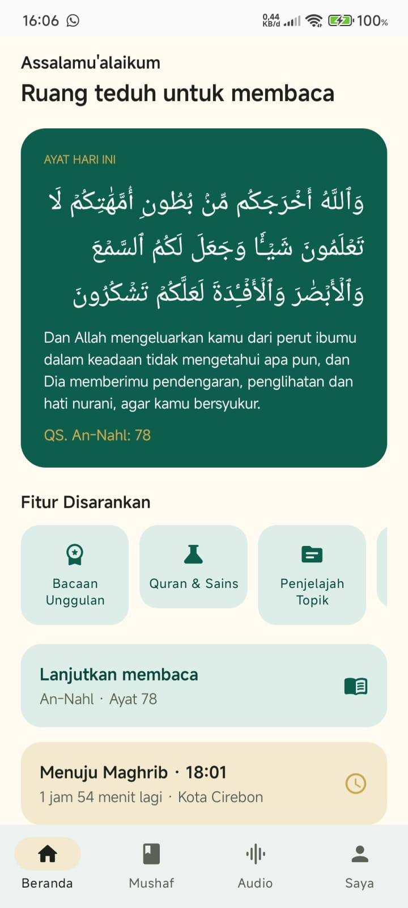
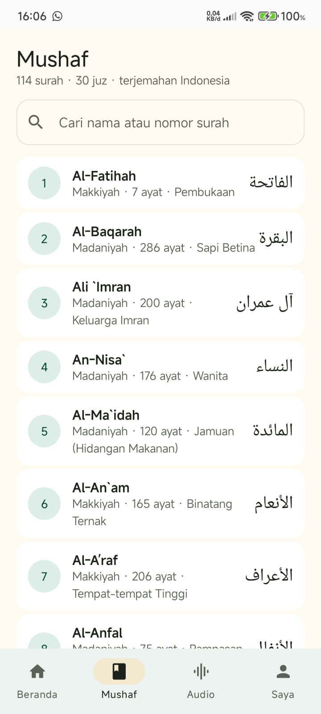
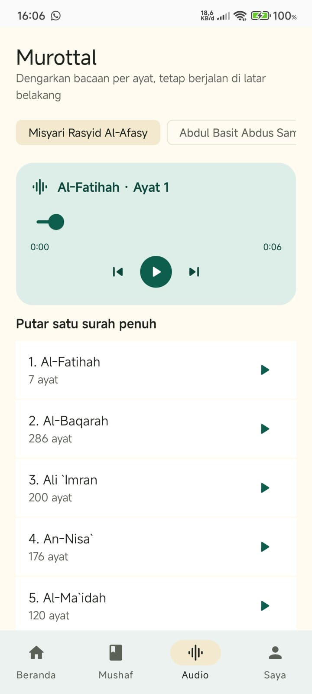
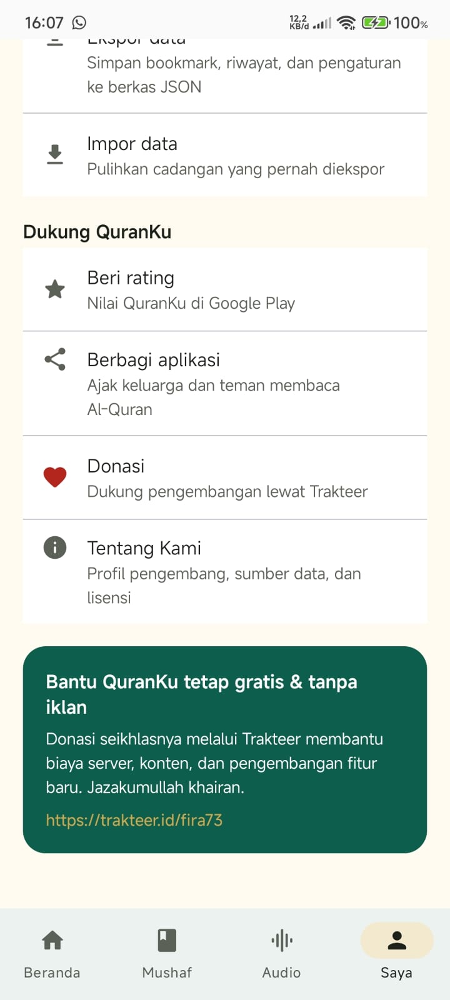
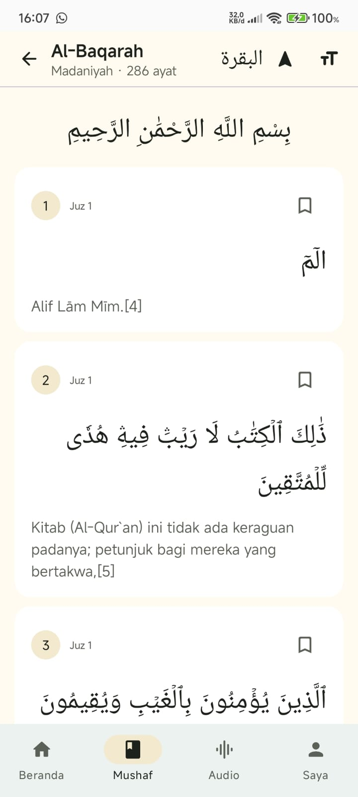

# Dokumentasi Foto Aplikasi

Berikut dokumentasi visual QuranKu dari build terbaru. Foto disimpan di folder `docs/foto/` agar dapat ditinjau langsung dari repositori.

## Beranda

## Mushaf

## Pencarian

## Pengaturan

## Fitur Nusantara

